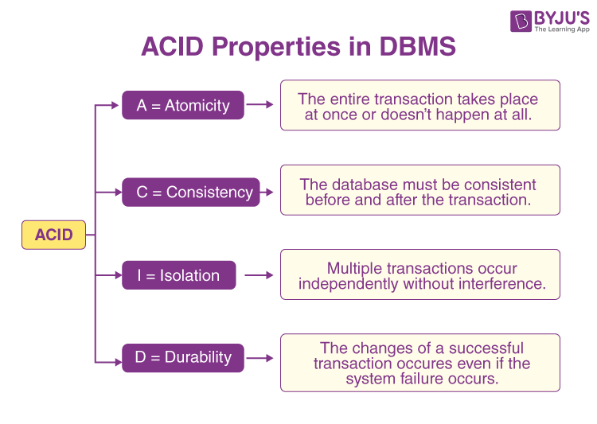

# Q. what is Atomicity ?
{
    Atomicity in dbms either the entire transcation takes place at
    once or nothing happens at all .
    
    Each transaction is considered as one unit
    
    Example :-
        E-commerce transactions
        For example, when a customer places an order, the
        transaction involves multiple steps, including inventory
        deduction, payment processing, and order confirmation .Atomicity ensures that all these steps are either
        successfully executed or not .
}

# Q. What is Consistency ?
{
    This means that integrity constraints must be maintained so that the database is consistent before and after the transaction. It refers to the correctness and 
    ensuring accuracy of information of a database .

    Example :-
        Bank account transactions
        A transaction that credits 5000 to an account with a current balance of 3000 is invalid if the account has an overdraft limit of 1000. The transaction violates consistency by exceeding the permissible account limit, so it is blocked and aborted.
}

# Q. what is Isolation ?
{
    Isolation ensures that multiple transactions can execute concurrently without interfering with each other. Each transaction must be isolated from other transactions until it is completed.
    Example :-
    let’s say that our account balance is $200. Two transactions for a $100 withdrawal start at the same time. The transactions run in isolation which guarantees that when they both complete, we’ll have a balance of $0 instead of $100.
}

# Q. what is Durability ?
{
    Durability ensures that once a transaction is committed, its changes are permanent and will survive any subsequent system failures. The transaction’s changes are saved to the database permanently, and even if the system crashes, the changes remain intact and can be recovered.

    Example :-
        Air reservation
        if a flight booking reports that a seat has successfully been booked, then the seat will remain booked even if the system crashes
}