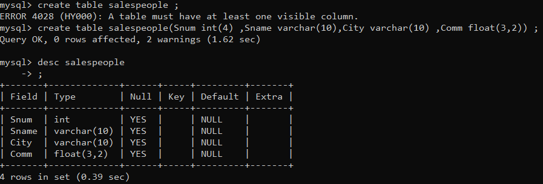
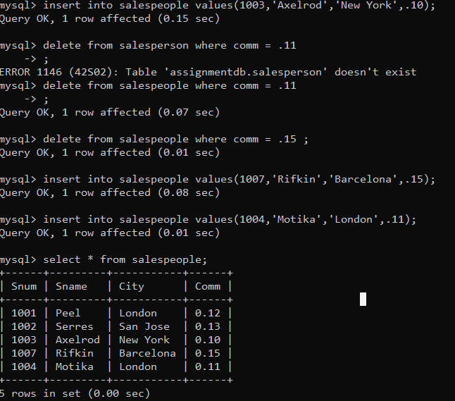
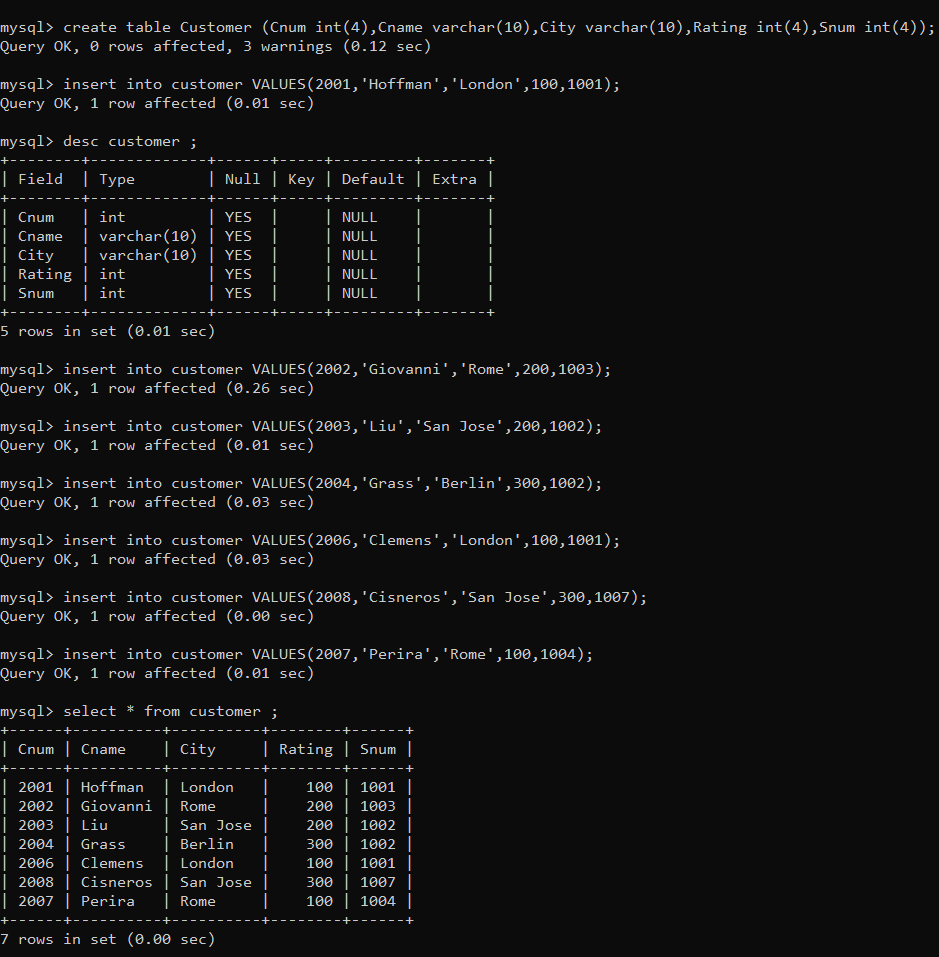
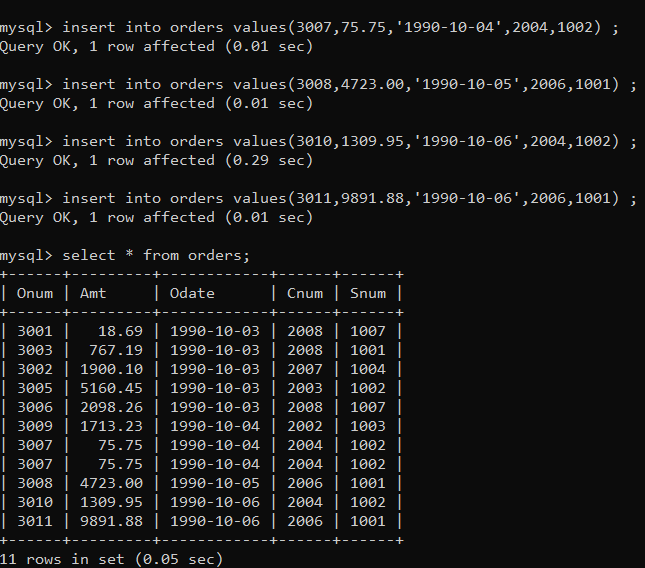

# Create the following tables with the given structures and insert sample data as specified:-

Table ->{
                    SALESPEOPLE
                    Snum             int(4)  
                    Sname            varchar(10)  
                    City             varchar(10)  
                    Comm             float(3,2) 
        }

Table ->{
            CUSTOMERS  
            Cnum              int(4)  
            Cname            varchar(10)  
            City                 varchar(10)  
            Rating             int(4)  
            Snum              int(4)  
        }

Table ->{
            ORDERS  
            Onum             int(4)  
            Amt              float(7,2)   
            Odate            date  
            Cnum             int(4)   
            Snum             int(4)
        }

