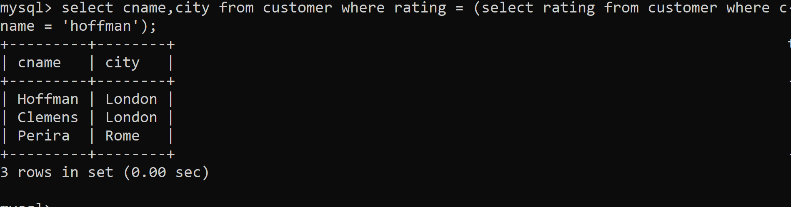

1) Write a query that produces all pairs of salespeople who are living in the same city.Exclude combinations of salespeople with themselves as well as duplicate rows with the order reversed.

2) Write a query that produces the names and cities of all customers with the same rating as Hoffman.

