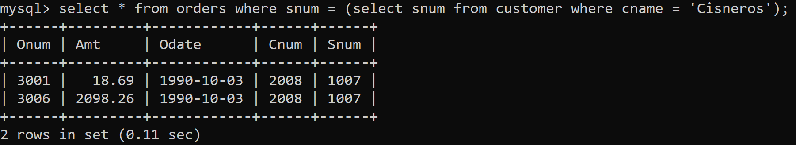
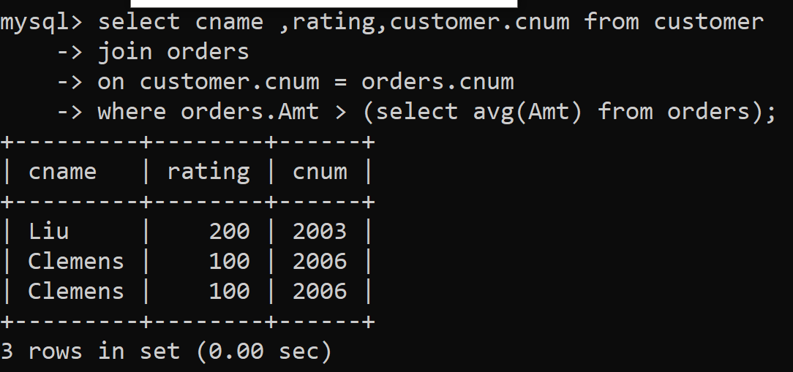
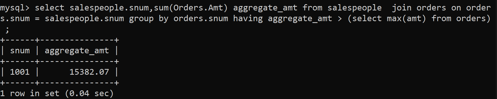

1) Write a query that uses a subquery to obtain all orders for the customer named Cisneros. Assume you do not know his customer number (cnum).



2) Write a query that produces the names and ratings of all customers who have above-average orders.



3) Write a query that selects the total amount in orders for each salesperson for whom this total is greater than the amount of the largest order in the table.

```
select salespeople.snum,sum(Orders.Amt) aggregate_amt from salespeople  join orders on orders.snum = salespeople.snum group by orders.snum having aggregate_amt > (select max(amt) from orders) ;
```



