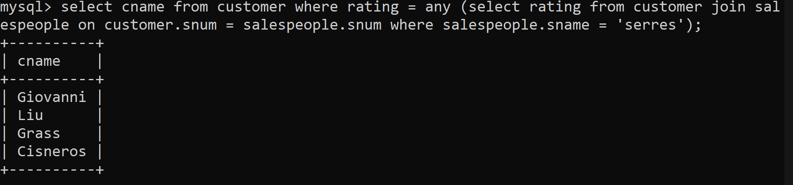
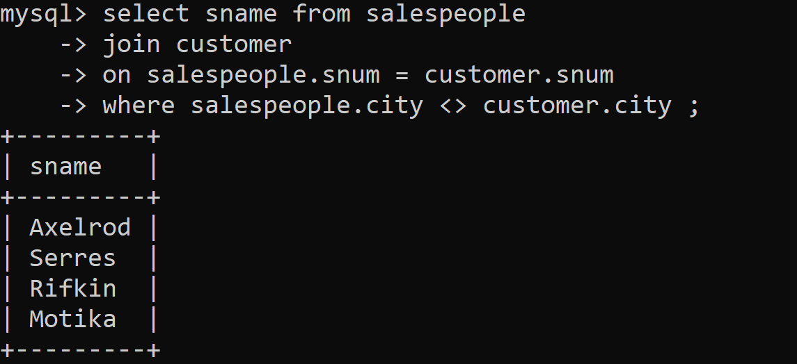
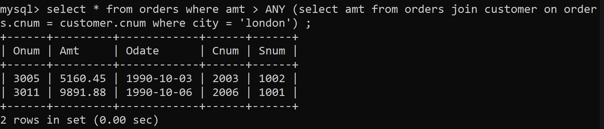
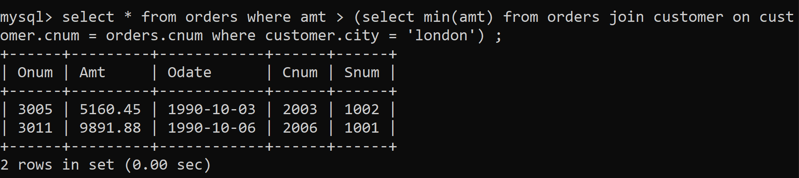

1) Write a query that selects all customers whose ratings are equal to or greater than ANY of Serres’.

```
select cname from customer where rating = ANY (select rating from customer join salespeople on customer.snum = salespeople.snum where salespeople.sname = 'serres')
```



2) Write a query using ANY or ALL that will find all salespeople who have no customers located in their city.

!missing case


3) Write a query that selects all orders for amounts greater than any for the customers in London.

```
select * from orders where amt > ANY (select amt from orders join customer on orders.cnum = customer.cnum where city = 'london') ;
```



4) Write the above query using MIN or MAX.

```
select * from orders where amt > (select max(amt) from orders join customer on customer.cnum = orders.cnum where customer.city = 'london') ;
```

