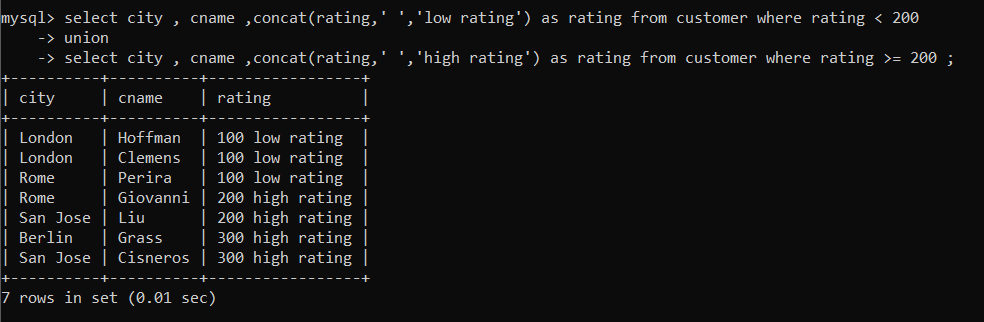
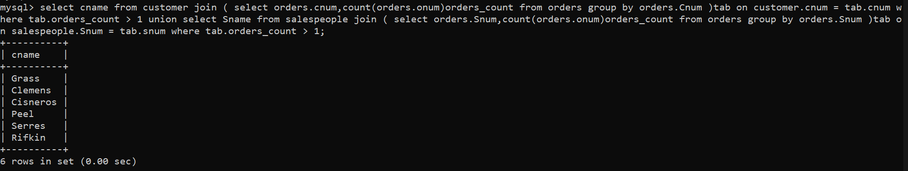
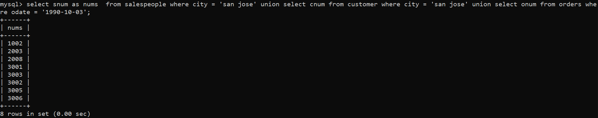

1) Create a union of two queries that shows the names, cities, and ratings of all customers. Those with rating of 200 or greater will also have the words “High Rating”, while the others will have the words “Low Rating”.



2) Write a command that produces the name and number of each salesperson and each customer with more than one current order. Put the results in alphabetical order.
```
select cname from customer join ( select orders.cnum,count(orders.onum)orders_count from orders group by orders.Cnum )tab on customer.cnum = tab.cnum where tab.orders_count > 1 union select Sname from salespeople join ( select orders.Snum,count(orders.onum)orders_count from orders group by orders.Snum )tab on salespeople.Snum = tab.snum where tab.orders_count > 1; 
```



3) Form a union of three queries. Have the first select the snums of all salespeople in San Jose; the second, the cnums of all customers in San Jose; and the third the onums of all orders on October 3. Retain duplicates between the last two queries but eliminate any redundancies between either of them and the first.
(Note: in the sample tables as given, there would be no such redundancy. This is besides the point.)

```
select snum  from salespeople where city = 'san jose' union select cnums from customer where city = 'san jose' union select onums from orders where odate = '1990-10-03';
```

