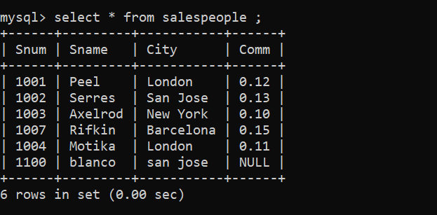
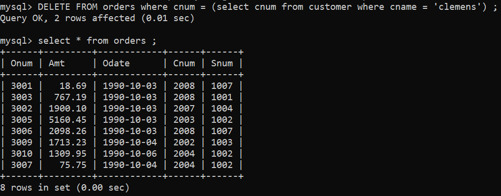
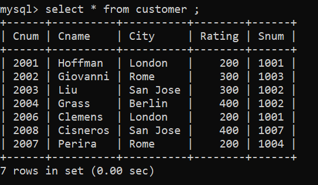
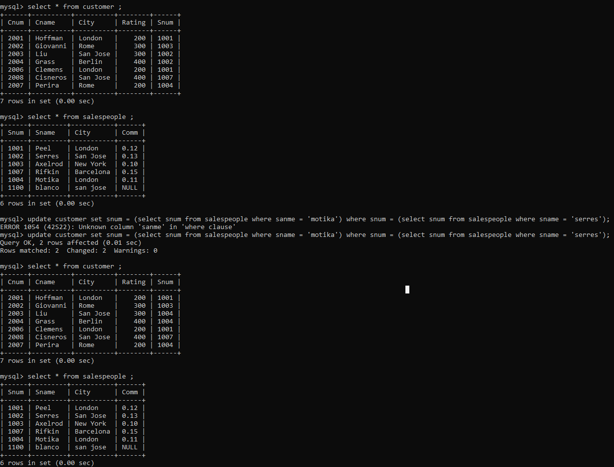

1) Write a command that puts the following values, in their given order, into the salespeople table: city – San Jose, name – Blanco, comm – NULL, cnum – 1100.

```
insert into salespeople(city,sname,comm,snum) values('san jose','blanco',NULL,1100);
```



2) Write a command that removes all orders from customer Clemens from the Orders table.



3) Write a command that increases the rating of all customers in Rome by 100.

```
update customer SET rating = rating + 100 ;
```



4) Salesperson Serres has left the company. Assign her customers to Motika.

```
update customer set snum = (select snum from salespeople where sname = 'motika') where snum = (select snum from salespeople where sname = 'serres');
 ```

