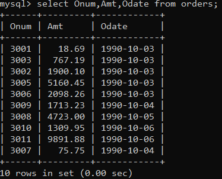
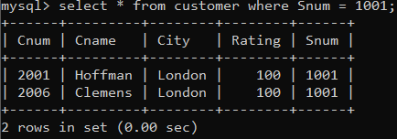
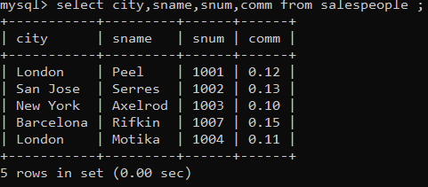
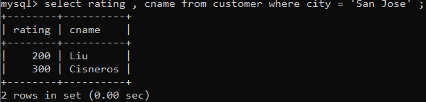
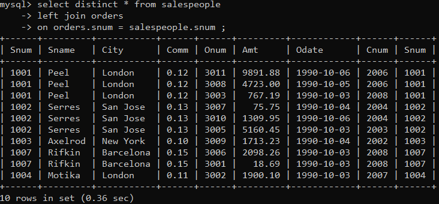

1) Write a select command that produces the order number amount,  and date for all rows in the Orders table.

2) Write a query that produces all rows from the Customers table for which the salesperson’s number is 1001.

3) Write a query that displays the Salespeople table with the columns in the following order: city, sname, snum, comm.

4) Write a select command that produces the rating followed by the name of each customer in San Jose.

5) Write a query that will produce the snum values of all salespeople (suppress the duplicates) with orders in the Orders table.

