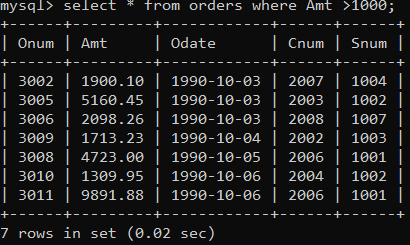
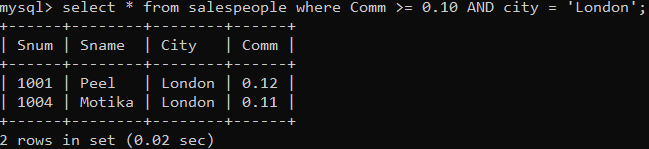
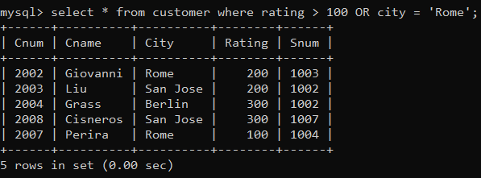
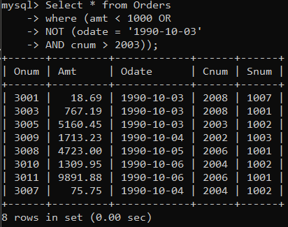
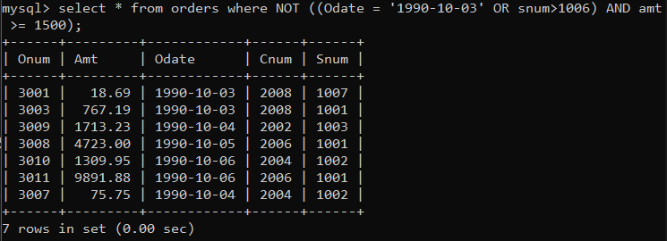
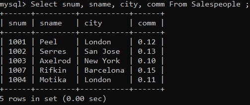

1) Write a query that will give you all orders for more than Rs. 1000. 

2) Write a query that will give you the names and cities of all salespeople in London with a commission above .10.   

3) Write a query on the Customers table whose output will exclude all customers with a rating <= 100, unless they are located in Rome. 

4) What will be the output from the following query?
Select * from Orders
where (amt < 1000 OR
NOT (odate = ‘1990-10-03’
AND cnum > 2003));

5) What will be the output of the following query?  
Select * from Orders              
where NOT ((odate = ‘1990-10-03’ OR snum>1006) AND amt >= 1500);

6) What is a simpler way to write this query?   
Select snum, sname, city, comm From Salespeople              
where (comm > .12 OR comm <.14);

