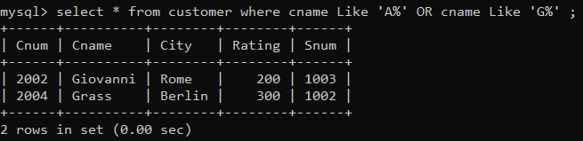

1) Write two different queries that would produce all orders taken on October 3rd or 4th, 1990. 

2) Write a query that selects all of the customers serviced by Peel or Motika. 
(Hint: the snum field relates the two tables to one another).  

3) Write a query that will produce all the customers whose names begin with a letter from ‘A’ to ‘G’.

4) Write a query that selects all customers whose names begin with the letter ‘C’.

5) Write a query that selects all orders except those with zeroes or NULLs in the amt field.

