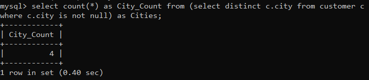

1) Write a query that counts all orders for October 3.

2) Write a query that counts the number of different non-NULL city values in the Customers table. 

3) Write a query that selects each customer’s smallest order.

4) Write a query that selects the first customer, in alphabetical order, whose name begins with G.

5) Write a query that selects the highest rating in each city. 

6) Write a query that counts the number of salespeople registering orders for each day. (If a salesperson has more than one order on a given day, he or she should be counted only once).

Partially solved
{
    select odate , count(odate) as Orders_Count from ( select sname,orders.odate from salespeople inner join orders on orders.snum = salespeople.snum ) as o group by odate ;
}

