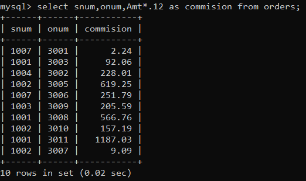
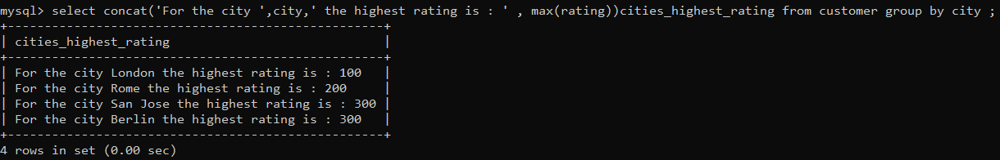
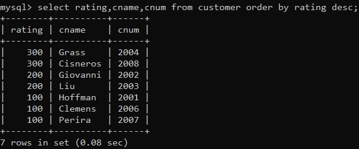
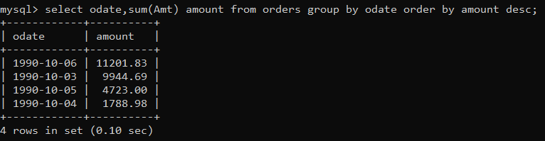

1) Assume each salesperson has a 12% commission. Write a query on the orders table that will produce the order number, the salesperson number, and the amount 
of the salesperson’s commission for that order. 

2) Write a query on the Customers table that will find the highest rating in each city. Put the output in this form: For the city (city), the highest rating is : (rating). 

3) Write a query that lists customers in descending order of rating. Output the rating 
field first, followed by the customer’s name and number. 

4) Write a query that totals the orders for each day and places the results in descending order.

