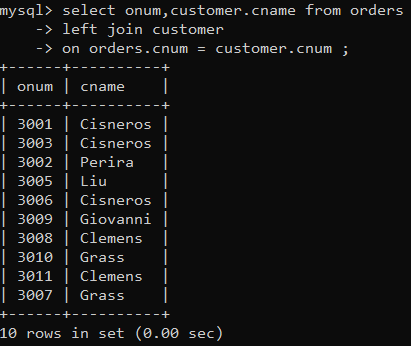
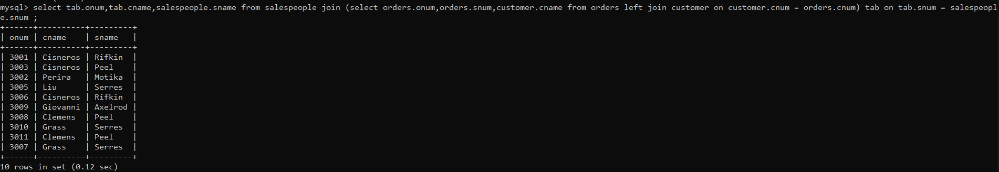
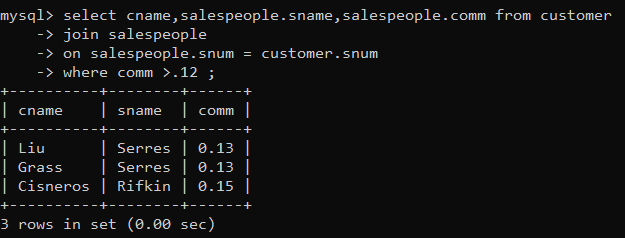
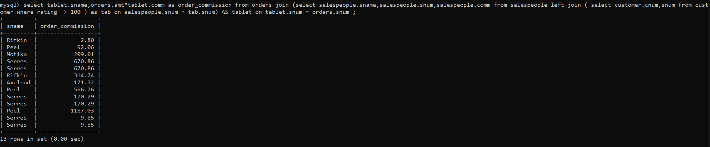

1) Write a query that lists each order number followed by the name of the customer who made the order. 



2) Write a query that gives the names of both the salesperson and the customer for each order along with the order number. 

**select tab.onum,tab.cname,salespeople.sname from salespeople join (select orders.onum,orders.snum,customer.cname from orders left join customer on customer.cnum = orders.cnum) tab on tab.snum = salespeople.snum ;**



3) Write a query that produces all customers serviced by salespeople with a commission above 12%. Output the customer’s name, the salesperson’s name, and the salesperson’s rate of commission. 



4) Write a query that calculates the amount of the salesperson’s commission on each order by a customer with a rating above 100.


```
    select tablet.sname,orders.amt*tablet.comm as order_commission from orders join (select salespeople.sname,salespeople.snum,salespeople.comm from salespeople left join ( select customer.cnum,snum from customer where rating  > 100 ) as tab on salespeople.snum = tab.snum) AS tablet on tablet.snum = orders.snum ;
```