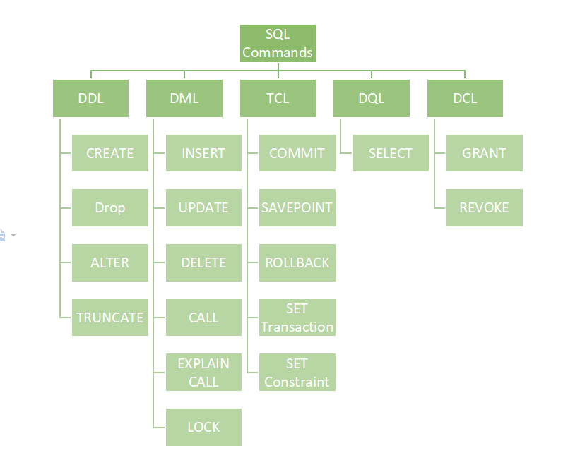

.

These SQL commands are mainly categorized into five categories: 

    DDL – Data Definition Language
    DQL – Data Query Language
    DML – Data Manipulation Language
    DCL – Data Control Language
    TCL – Transaction Control Language
